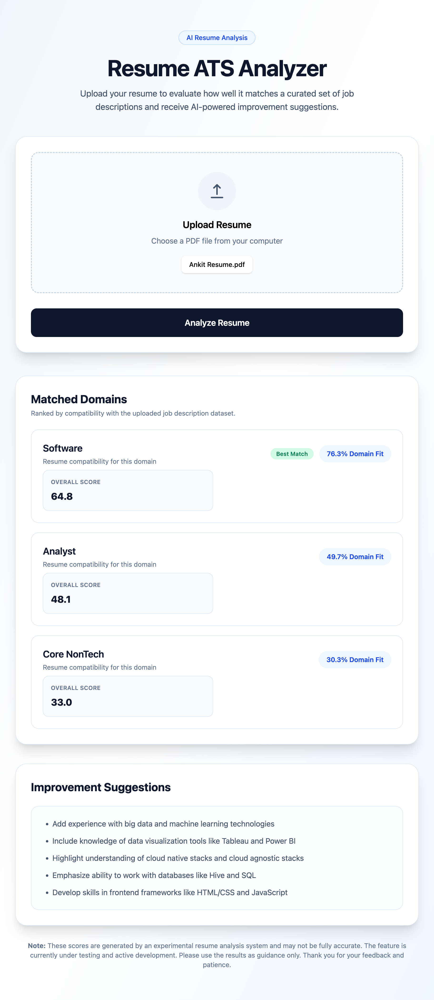

# Resume ATS Analyzer

A simple web application that evaluates resumes against a **curated dataset of job descriptions** and provides domain-wise matching scores along with AI-powered improvement suggestions.



> **Note:** This platform evaluates resumes only against the job descriptions uploaded by the administrator. The generated scores reflect compatibility with this specific curated dataset and are **not** intended to represent a general ATS score or compatibility with all job descriptions.

---

## Features

- Upload PDF resumes
- Domain-wise resume matching
- Overall resume compatibility score
- AI-generated resume improvement suggestions
- Clean and responsive React frontend
- Node.js + Express backend

---

## Tech Stack

### Frontend

- React
- Vite
- Tailwind CSS

### Backend

- Node.js
- Express.js

### Resume Analysis Engine

The actual resume analysis is performed by a separate FastAPI service.

Repository:
**https://github.com/rajeraankit4/resume-ats-fastapi**

---

## Project Structure

```
resume-ats/
├── frontend/
└── backend/
```

---

# Installation

## 1. Clone the Repository

```bash
git clone <repository-url>
cd resume-ats
```

---

## Backend Setup

Navigate to the backend directory:

```bash
cd backend
```

Install dependencies:

```bash
npm install
```

Create a `.env` file:

```env
RESUME_SERVER_URL=your_resume_analysis_server_url
PORT=5002
```

### Environment Variables

| Variable | Description |
|----------|-------------|
| `RESUME_SERVER_URL` | URL of the FastAPI resume analysis service |
| `PORT` | Port on which the backend server will run |

Start the backend:

```bash
npm start
```

or

```bash
npm run dev
```

Backend runs at:

```
http://localhost:5002
```

---

## Frontend Setup

Navigate to the frontend directory:

```bash
cd frontend
```

Install dependencies:

```bash
npm install
```

Create a `.env` file:

```env
VITE_API_URL=http://localhost:5002
```

### Environment Variables

| Variable | Description |
|----------|-------------|
| `VITE_API_URL` | Backend API URL |

Start the frontend:

```bash
npm run dev
```

Frontend runs at:

```
http://localhost:5173
```

---

# Usage

1. Open the frontend in your browser.
2. Upload a PDF resume.
3. Click **Analyze Resume**.
4. The frontend sends the resume to the Node.js backend.
5. The backend forwards the request to the FastAPI resume analysis service.
6. The analysis results are returned and displayed on the frontend, including:
   - Domain-wise compatibility scores
   - Overall resume scores
   - AI-generated improvement suggestions

---

# Architecture

```
                PDF Resume
                     │
                     ▼
         React + Vite Frontend
                     │
              HTTP Request
                     │
                     ▼
         Node.js + Express Backend
                     │
        Forwards Resume Request
                     │
                     ▼
     FastAPI Resume Analysis Engine
                     │
          Analysis & AI Suggestions
                     │
                     ▼
         Node.js + Express Backend
                     │
                     ▼
         React + Vite Frontend
```

---

# Resume Analysis

This project **does not perform the resume analysis itself**.

The backend acts as a lightweight API that forwards uploaded resumes to a dedicated FastAPI-based resume analysis service.

The complete implementation of the resume analysis engine, including:

- Resume parsing
- Job description matching
- Domain scoring
- AI-generated suggestions

is available in the following open-source repository:

**https://github.com/rajeraankit4/resume-ats-fastapi**

---

# Notes

- Only **PDF** resumes are supported.
- Resume evaluation is performed against a **curated collection of job descriptions** uploaded by the administrator.
- Scores indicate compatibility with this specific dataset only.
- The results should **not** be interpreted as a general ATS score or compatibility with all job descriptions.

---

# Disclaimer

This project is experimental and under active development.

The generated scores and AI suggestions are intended to provide guidance only and may not always be accurate.

